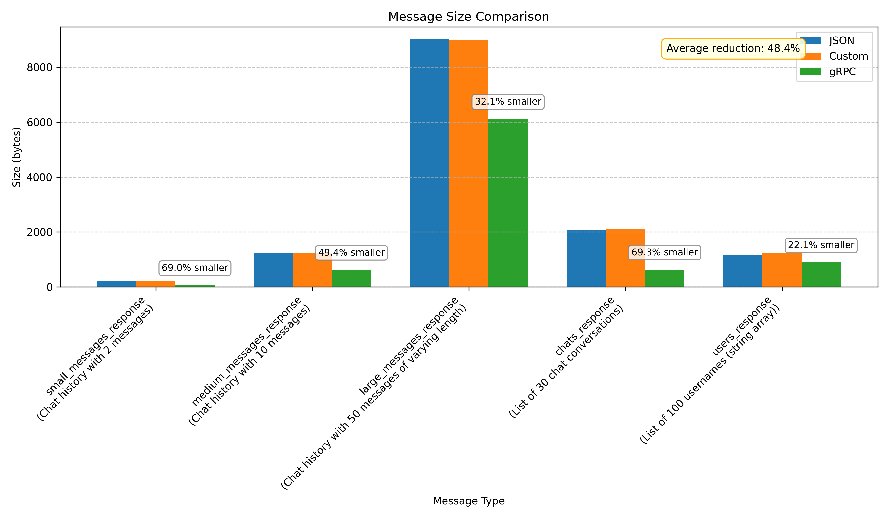

# Protocol Size Comparison Analysis Report

## Overview

The benchmark in [`protocol_size_benchmark.py`](protocol_size_benchmark.py) tested five representative message types from our chat application to evaluate potential bandwidth savings. You can reproduce these by running `make benchmark` from the root directory.

## Key Findings

- **Average Size Reduction**: gRPC messages are **48.4% smaller** than equivalent JSON messages on average
- **Total Bandwidth Savings**: For transferring 1GB of data, using gRPC would save approximately **0.39GB** compared to JSON
- **Best Case**: `chats_response` (list of 30 chat conversations) showed the highest efficiency with **69.3% reduction**
- **Worst Case**: `users_response` (list of 100 usernames) showed the lowest efficiency with **22.1% reduction**

## Detailed Results

| Message Type             | JSON (bytes) | Custom (bytes) | gRPC (bytes) | Reduction | Ratio    |
| ------------------------ | ------------ | -------------- | ------------ | --------- | -------- |
| small_messages_response  | 216          | 221            | 67           | 69.0%     | 3.2x     |
| medium_messages_response | 1227         | 1231           | 621          | 49.4%     | 2.0x     |
| large_messages_response  | 9017         | 8981           | 6121         | 32.1%     | 1.5x     |
| chats_response           | 2054         | 2089           | 630          | 69.3%     | 3.3x     |
| users_response           | 1147         | 1251           | 894          | 22.1%     | 1.3x     |
| **TOTAL**                | **13661**    | **13773**      | **8333**     | **39.0%** | **1.6x** |

## Analysis by Message Structure

- **Nested Structures** (message response types): **50.2% average reduction**
- **Repeated Fields** (arrays in chats and users responses): **45.7% average reduction**

## Observations

1. **Message Structure Impact**:

   - gRPC shows the highest efficiency with nested objects (e.g., message responses)
   - Simple string arrays (e.g., usernames list) show the least improvement

2. **Scale Effect**: The efficiency ratio decreases as message size increases:

   - Small messages: 3.2x smaller
   - Medium messages: 2.0x smaller
   - Large messages: 1.5x smaller

3. **Adopt gRPC for Bandwidth-Sensitive Operations**: The significant size reduction (39% overall) makes gRPC a strong choice for bandwidth-constrained environments.

4. **Focus on High-Impact Messages**: The greatest benefits are seen in frequently transmitted message types like chat histories and conversation lists.
